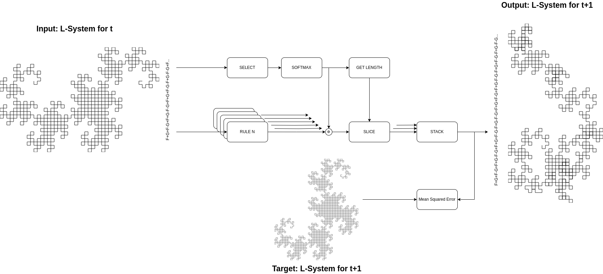

# NeuralLindenmayerSystem

## Visual Abstract

## WIP
The `Arrowhead` and `Fern` dataset are still highly WIP (convergence is still an issue - and highly sensitive to initialization and hyperparameter selection.

## Related Work
Neural-CAs, see https://github.com/delpart/CA-Torch

Tu, C.-H., Chen, H.-Y., Carlyn, D., & Chao, W.-L. (2023). Learning Fractals by Gradient Descent. www.aaai.org

Chen, X. E., & Ross, B. J. (2021). Deep Neural Network Guided Evolution of L-System Trees. 2021 IEEE Congress on Evolutionary Computation (CEC), 2507–2514. https://doi.org/10.1109/CEC45853.2021.9504827

Guo, J., Jiang, H., Benes, B., Deussen, O., Zhang, X., Lischinski, D., & Huang, H. (2020). Inverse Procedural Modeling of Branching Structures by Inferring L-Systems. ACM Transactions on Graphics, 39(5), 1–13. https://doi.org/10.1145/3394105

Hornby, G. S., & Pollack, J. B. (2001). Evolving L-systems to generate virtual creatures. Computers & Graphics, 25(6), 1041–1048. https://doi.org/10.1016/S0097-8493(01)00157-1

### Somewhat Related
Lucny, A. (n.d.). On Lindenmayer Systems and Autoencoders. http://dai.fmph.uniba.sk/w/Andrej_Lucny/en

de Campos, L. M. L., de Oliveira, R. C. L., & Roisenberg, M. (2015). Evolving Artificial Neural Networks through L-system and evolutionary computation. 2015 International Joint Conference on Neural Networks (IJCNN), 1–9. https://doi.org/10.1109/IJCNN.2015.7280535
